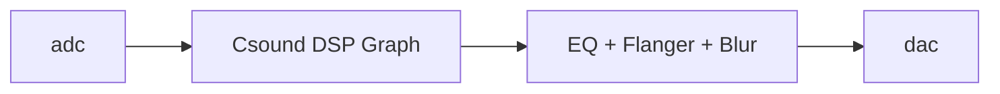

# **GhostEcho — System Design Document**

**Version:** 1.0
**Author:** Daphne Tao (DAPHNIII)
**Last Updated:** November 2025

-

## 1. Introduction

GhostEcho aims to provide an accessible entry point, a simple and intuitive tool that allows people to experience and use sound effects creatively without learning professional production software. It is designed for both musicians and non-musicians with no DAW experience, enabling them to explore sound design intuitively and apply it directly in live performance.

GhostEcho is a web-based audio processing system that provides both **offline (Studio Mode)** and **real-time (Live Mode)** sound manipulation capabilities. The system offers a curated suite of effects inspired by the way songs replay in our minds. Not quite the original version, but the way we remember them.

This document specifies the system’s **architecture**, **design rationale**, **technical trade-offs**, **API structure**, and **future roadmap**.


## 2. Goals & Non-Goals
#### 2. Goals


* Provide a zero-install, browser-accessible sound design tool.
* Offer low latency live audio processing using a Csound DSP engine.
* Support full-track offline transformations with intuitive controls.
* Maintain traceable audio states for repeatable rendering.
* Ensure the system is extensible for future DSP modules and UI improvements.

### 2.2 Non-Goals


* Not intended to replace professional DAWs.
* Not designed for multi-track recording or mixing workflows.
* Not optimized for mobile devices in the current release.


## 3. System Overview

GhostEcho consists of three coordinated subsystems:

```
Frontend (Gradio + Wavesurfer.js)
          │
          ▼
Backend Processing (Python DSP + Offline Processing)
          │
          ├── Studio Mode (Python)
          └── Live Mode (OSC → Csound Engine)
          ▼
Audio Export / Real-Time Output
```


## 4. Architecture

#### 4.1 High-Level Architecture Diagram

```mermaid
flowchart TD
    UI[Web UI (Gradio)] --> Decode[Audio Decode & WAV Normalization]
    Decode --> StudioMode[Studio DSP Engine (Python)]
    Decode --> LiveMode[Live DSP Engine (Csound + OSC)]
    StudioMode --> Preview[Waveform Preview]
    LiveMode --> OutputDAC[Audio Output (dac)]
    StudioMode --> Export[WAV/MP3 Export]
```


## 5. Component Design

### 5.1 UI Layer (Gradio)

#### Responsibilities

* File upload & validation
* Waveform preview (Wavesurfer.js)
* Parameter controls: Mode selection, Intensity knob, Fast Preview toggle, Export format
* Device management (adc/dac selection)

#### Design Notes

* UI operations must remain non-blocking.
* Auto-processing is used to provide immediate feedback.

---


### 5.2 Studio Mode (Offline DSP, Python)

#### Overview

Studio Mode allows full-track transformations using custom DSP functions implemented in `distortions.py`.

#### Processing Pipeline

```
Upload → Decode to WAV → Apply DSP → Normalize → Export
```

#### Algorithms (Examples)

* **Memory Echo:** multi-layered delay with psychoacoustic detune
* **Ghost Blur:** spectral smearing + transient attenuation
* **Lo-Fi Memory:** bit-depth reduction + added tape hiss
* **Slow Fade:** segment-based timestretch (librosa)

#### Libraries

* `pydub`
* `librosa`
* `numpy`, `scipy`
* `soundfile`

---

### 5.3 Live Mode (Real-Time DSP, Csound)

### Overview

Live Mode connects Gradio sliders/knobs to Csound via OSC.
Csound handles all real-time DSP at audio rate.

#### Communication Model

```
Frontend ──OSC──▶ Csound Audio Engine (ghostecho_live.csd)
```

#### Csound Features

- Real-time stereo input/output
- Effect modules:

  * Pitch shifting
  * Ring modulation
  * Blur (spectral smear)
  * Flanger + LFO
  * 3-Band EQ
- Low-latency buffer settings
- Channel-based control mapping via `chn_k`

#### Reason for Choosing Csound

* Stable real-time audio pipeline
* Low latency
* Strong OSC support
* Mature DSP opcode library


## **6. Data Models**

### **6.1 Audio State Object**

```json
{
  "input_wav": "path/to/cached.wav",
  "active_mode": "ghost",
  "intensity": 74,
  "fast_preview": true,
  "export_format": "wav",
  "device": {
    "adc": 0,
    "dac": 1
  }
}
```

### **6.2 Processing Response Model**

```json
{
  "preview_wav": "temp/output_preview.wav",
  "duration": 32.14,
  "peak_level": -1.2,
  "status": "success"
}
```


## **7. API Design**

### **7.1 Public API (Python Internal)**

#### `apply_distortion(input_path, mode, intensity)`

* **Purpose:** Offline processing
* **Returns:** path to processed WAV

#### `process_live_param(param_name, value)`

* Sends OSC to Csound
* Non-blocking

#### `render_export(output_format)`

* Encodes WAV → MP3 only when needed


## **8. Performance Considerations**

### **8.1 Offline (Studio Mode)**

* Segment-wise processing balances compute vs. fidelity
* librosa timestretching is cached to minimize repeated computation
* No multithreading available via Gradio, so operations kept under 2–4s

### **8.2 Real-Time (Live Mode)**

* Csound buffer set to:

  ```
  ksmps = 64  
  0dbfs = 1  
  ```
* OSC parameters update at control rate


## **9. Security & Safety**

* No persistent storage
* All temporary files wiped on session end
* Only local audio files accepted
* No remote execution or dynamic code loading
* UI sanitizes HTML to prevent script injection


## **10. Testing Strategy**

### **10.1 Unit Tests**

* DSP function outputs
* Segment boundaries
* WAV decode/encode correctness
* OSC command dispatch

### **10.2 Integration Tests**

* UI → backend update propagation
* Csound roundtrip signal integrity
* Export correctness (WAV/MP3)

### **10.3 Manual Tests**

* Latency measurement for Live Mode
* Large file stress test ( > 5 min tracks )


## **11. Failure Scenarios & Mitigations**

| Failure                     | Cause                 | Mitigation                       |
| --------------------------- | --------------------- | -------------------------------- |
| Csound not detecting device | System audio routing  | Provide retry + device refresh   |
| Silence or no effect        | Wrong channel mapping | Strict parameter validation      |
| MP3 export failure          | Missing FFmpeg        | Fallback to WAV only             |
| UI freeze                   | Heavy DSP chain       | Background thread for processing |


## **12. Dependencies**

Complete list from requirements:

```
gradio==5.4.0
pydub==0.25.1
librosa==0.10.2.post1
soundfile==0.12.1
resampy==0.4.3
numpy==1.26.4
numba==0.59.1
llvmlite==0.42.0
scipy==1.13.1
python-osc==1.8.3
```

Additional:

* **Csound 6+**
* **FFmpeg** (MP3 encoding)


## **13. Future Roadmap**

### **Short-Term**

* Expand DSP modes 
* Optimize DSP algorithms for higher fidelity
* User preset system
* Develop a VST/AU plugin version 

### **Medium-Term**

* WebMIDI support
* Push/MPC controller mapping
* Rebuild the web interface without using Gradio, focusing on a custom and polished UI.

### **Long-Term**

* Collaborative multi-user performance mode
* Mobile interactive app


## **14. Appendix**

### **14.1 Audio Signal Path (Live Mode)**



### **14.2 Example OSC Mapping**

| UI Control  | OSC Channel | Range |
| ----------- | ----------- | ----- |
| Blur Wet    | `blur_wet`  | 0–1   |
| Ring ON     | `ring_on`   | 0/1   |
| LFO Rate    | `lfo_rate`  | 0–1   |


## **End of Document**

